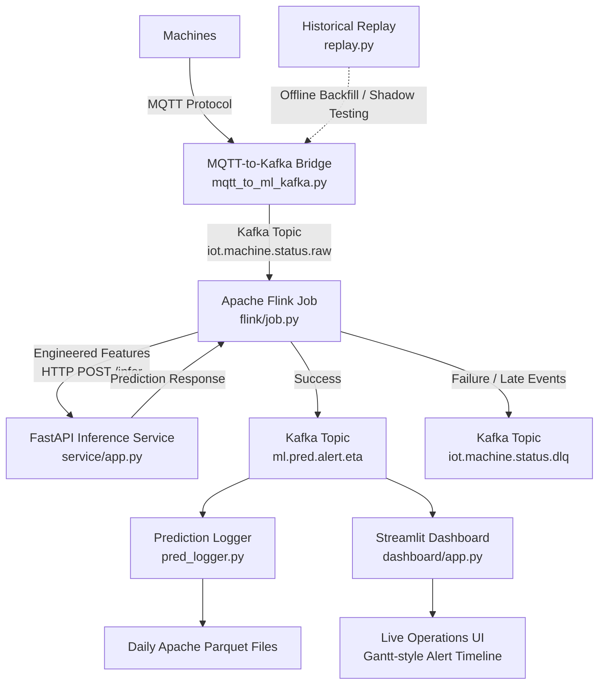

The architecture forms a real-time predictive pipeline that ingests industrial machine status updates, dynamically engineers temporal features, evaluates machine behavior using LightGBM machine learning models, and delivers actionable ETA alerts to operators.

# Real-Time Machine Status Prediction Pipeline

A real-time machine status prediction system that ingests machine events from MQTT, streams them through Kafka and Apache Flink, performs stateful feature engineering, calls a FastAPI inference service, and publishes predicted machine alert ETA results for logging and live dashboard monitoring.

---

## Overview

This system is designed for real-time predictive maintenance and machine exception forecasting.

The pipeline receives machine status events, transforms them into a standardized schema, generates dynamic time-based features, performs real-time inference using pretrained LightGBM models, and sends prediction results to downstream applications such as:

- Prediction logging and auditing
- Model retraining datasets
- Live operator dashboards
- Maintenance prioritization workflows

---

## System Architecture



---

## Step-by-Step Data Flow

### 1. Data Ingestion & Bridging

**Component:** `mqtt_to_ml_kafka.py`

The MQTT-to-Kafka bridge subscribes to machine status events from an MQTT broker using hierarchical machine topics.

Example MQTT topic pattern:

```text
status/nhb/assy/#
```

The bridge parses the topic structure:

```text
status/{plant}/{process}/{mc_no}
```

From this, it extracts:

- `plant`
- `process`
- `mc_no`
- machine status payload

Example incoming payload:

```json
{
  "status": "RUN"
}
```

The payload is standardized into a versioned JSON schema containing:

- `event_id`
- `mc_no`
- `mc_status`
- `occurred_ts`
- `ingest_ts`

The `mc_status` value is forced to lowercase before being written downstream.

**Output Kafka topic:**

```text
iot.machine.status.raw
```

For offline evaluation or shadow testing, historical CSV or Parquet datasets can also be replayed into this same topic using:

```text
replay.py
```

---

### 2. Stream Processing & Stateful Feature Engineering

**Component:** `flink/job.py`

Apache Flink consumes raw events from:

```text
iot.machine.status.raw
```

The Flink job performs real-time stream processing with event-time handling.

Core responsibilities include:

- Consuming raw machine status events
- Assigning event-driven watermarks
- Handling out-of-order data
- Filtering highly latent records
- Sending late records older than 120 minutes to the Dead Letter Queue
- Grouping events by machine ID
- Building stateful per-machine features

Late or invalid records are routed to:

```text
iot.machine.status.dlq
```

Events are grouped per machine using:

```python
.key_by(lambda d: d["mc_no"])
```

This ensures that feature calculations are isolated per machine.

---

## Stateful Feature Builder

**Component:** `FeatureBuilder`

**Flink abstraction:** `KeyedProcessFunction`

The `FeatureBuilder` tracks historical machine activity using Flink managed state through:

```python
ValueStateDescriptor
```

It generates **29 dynamic real-time features**, including:

### Calendar & Cyclical Features

- Hour
- Minute
- Weekday
- Weekend flag
- Sine/cosine cyclical time transformations

### Temporal Features

- Duration since last observed alert
- Time since last status change
- Consecutive same-status event counter

### Inter-Alert Lag Features

Historical time intervals between consecutive machine alerts:

- Lag 1
- Lag 2
- Lag 3

### Rolling Window Features

Rolling event and alert frequencies calculated over:

- 15-minute windows
- 60-minute windows

### One-Hot Encoded Features

Fixed-category arrays for:

- Current machine status
- Previous alert type

---

## 3. Real-Time Model Inference

**Component:** `service/app.py`

The Flink pipeline sends engineered features to the FastAPI inference service through a synchronous HTTP request.

**Endpoint:**

```text
POST /infer
```

The request is sent from Flink using:

```text
HttpInferMap
```

---

## Feature Enrichment

The inference service combines:

- **29 dynamic features** generated by Flink
- **5 machine behavioral lookup features** loaded from training profiles

The lookup features come from:

```text
artifacts_phase4.pkl
```

These behavioral features include machine-level historical patterns such as:

- Global median gap statistics
- Alert ratios
- Shift/activity profile behavior

---

## Model Suite

The enriched feature row is passed into three pretrained LightGBM models.

| Model | Purpose |
|---|---|
| `lgbm_quantile_p50_final.pkl` | Predicts the P50 ETA, or median expected time before an alert |
| `lgbm_quantile_p90_final.pkl` | Predicts the P90 ETA, or conservative upper-bound alert timing |
| `lgbm_next_type.pkl` | Predicts the next likely alert type |

Supported next-alert categories include:

- `alarm`
- `fullwork`
- `m/c stop`
- `no work`

---

## Inference Guardrails

The FastAPI service applies post-processing and safety policies before returning the prediction.

Guardrails include:

- Scaling calibration
- Floor and cap constraints per machine ID
- Classification confidence checks
- Alert type suppression when confidence is too low

If the predicted alert type confidence is below:

```python
TYPE_CONF_THRESHOLD = 0.6
```

The predicted alert type is suppressed as:

```python
None
```

This marks the result as uncertain.

---

## 4. Sink Routing & Output Demultiplexing

**Component:** `flink/job.py`

After inference, the FastAPI service returns a prediction response to Flink.

The response contains:

- Prediction results
- Timestamps
- Model registry metadata
- Status routing information

Flink then separates the results into two output paths.

### Successful Predictions

Successful outputs are tagged as:

```text
OUT
```

They are written to the main prediction topic:

```text
ml.pred.alert.eta
```

### Failed Predictions

Failures, timeout exceptions, or system-level errors are tagged as:

```text
DLQ
```

They are routed to:

```text
iot.machine.status.dlq
```

This allows failed records to be inspected later for debugging and recovery.

---

## 5. Downstream Consumers

The prediction topic is consumed by two main downstream applications.

```text
ml.pred.alert.eta
```

---

### Application A: Prediction Logger

**Component:** `pred_logger.py`

The prediction logger consumes prediction records from Kafka and stores them for long-term analysis.

Responsibilities:

- Consume prediction events
- Buffer records in micro-batches
- Flush data regularly into daily Apache Parquet files
- Preserve prediction history for reporting, auditing, and retraining

Flush policy:

```text
Every 1000 records or every 60 seconds
```

Output format:

```text
Apache Parquet
```

This creates an append-only historical store for:

- Analytical reporting
- Model performance monitoring
- Future retraining loops
- Audit trails

---

### Application B: Streamlit Dashboard

**Component:** `dashboard/app.py`

The Streamlit dashboard provides a live operations interface for plant-floor users.

Responsibilities:

- Read prediction events directly from Kafka
- Suppress non-actionable steady states such as normal `run` sequences
- Apply operator-defined time horizons
- Visualize upcoming machine exceptions
- Help operators prioritize maintenance actions

The dashboard displays predictions using a dynamic Gantt-style timeline chart built with:

```text
Altair
```

This allows operators to see upcoming machine exceptions in a time-based visual format.

---

## Kafka Topics

| Topic | Purpose |
|---|---|
| `iot.machine.status.raw` | Raw standardized machine status events |
| `iot.machine.status.dlq` | Dead Letter Queue for late records, failures, and timeout exceptions |
| `ml.pred.alert.eta` | Successful alert ETA prediction results |

---

## Main Components

| Component | File | Role |
|---|---|---|
| MQTT-to-Kafka Bridge | `mqtt_to_ml_kafka.py` | Subscribes to MQTT machine events and publishes standardized records to Kafka |
| Historical Replay | `replay.py` | Replays historical CSV or Parquet data into Kafka |
| Flink Job | `flink/job.py` | Performs stream processing, feature engineering, inference calls, and output routing |
| Feature Builder | `FeatureBuilder` | Generates per-machine stateful dynamic features |
| Inference API | `service/app.py` | Serves LightGBM models through FastAPI |
| Prediction Logger | `pred_logger.py` | Saves prediction results into daily Parquet files |
| Dashboard | `dashboard/app.py` | Displays live prediction timelines for operators |

---

## Prediction Flow Summary

```text
Machine
  -> MQTT
  -> MQTT-to-Kafka Bridge
  -> Kafka Raw Topic
  -> Apache Flink
  -> Stateful Feature Engineering
  -> FastAPI Inference Service
  -> Apache Flink Output Routing
  -> Kafka Prediction Topic
  -> Prediction Logger / Streamlit Dashboard
```

---

## Key Capabilities

- Real-time machine status ingestion
- MQTT-to-Kafka streaming bridge
- Event-time processing with Apache Flink
- Per-machine stateful feature engineering
- Dynamic rolling-window feature generation
- FastAPI-based real-time inference
- LightGBM quantile ETA prediction
- Next-alert type classification
- Confidence-based alert type suppression
- Dead Letter Queue routing
- Parquet-based historical logging
- Live Streamlit operations dashboard

---

## Tech Stack

| Layer | Technology |
|---|---|
| Messaging | MQTT, Apache Kafka |
| Stream Processing | Apache Flink |
| Feature Engineering | Flink Managed State |
| Model Serving | FastAPI |
| Machine Learning | LightGBM |
| Storage | Apache Parquet |
| Dashboard | Streamlit, Altair |
| Replay / Backfill | CSV, Parquet, `replay.py` |

---

## Repository Structure

```text
.
├── mqtt_to_ml_kafka/
│   └── mqtt_to_ml_kafka.py
├── replay/
│   └── replay.py
├── flink/
│   └── job.py
├── service/
│   └── app.py
├── service/models/
│   └── artifacts_phase4.pkl
│   └── lgbm_quantile_p50_final.pkl
│   └── lgbm_quantile_p90_final.pkl
│   └── lgbm_next_type.pkl
├── dashboard/
│   └── app.py
├── Predictions/
│   └── pred_logger.py

```

---

## Output

The final system produces real-time prediction events that estimate:

- The median expected time before an alert occurs
- A conservative upper-bound alert timing estimate
- The next likely alert type
- Prediction metadata for monitoring and auditing

These outputs are used by both automated logging systems and live operator dashboards to support proactive maintenance decisions.

```text
ml.pred.alert.eta
```
